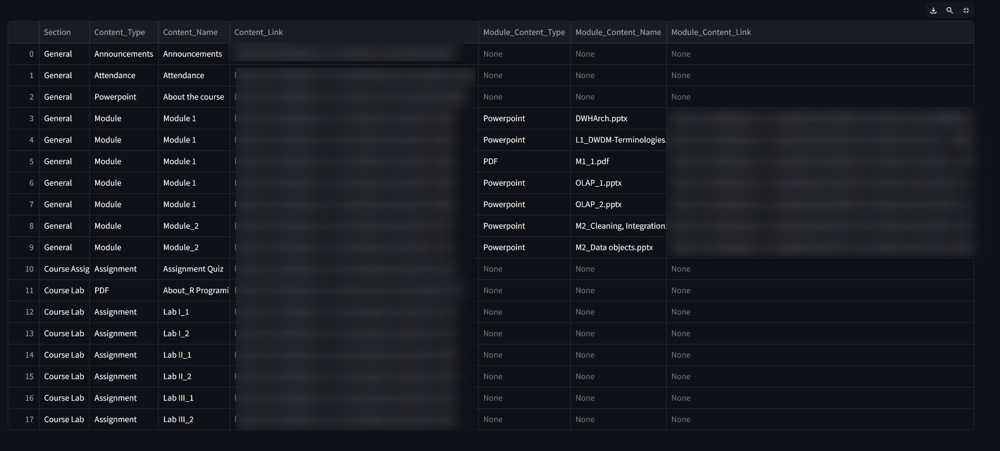
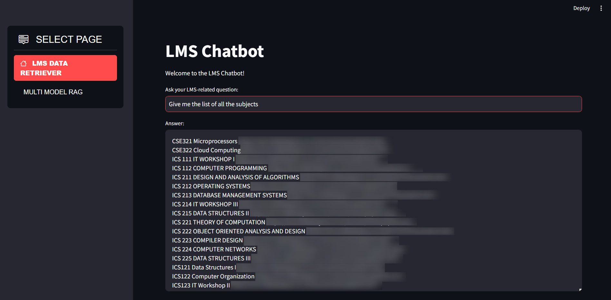
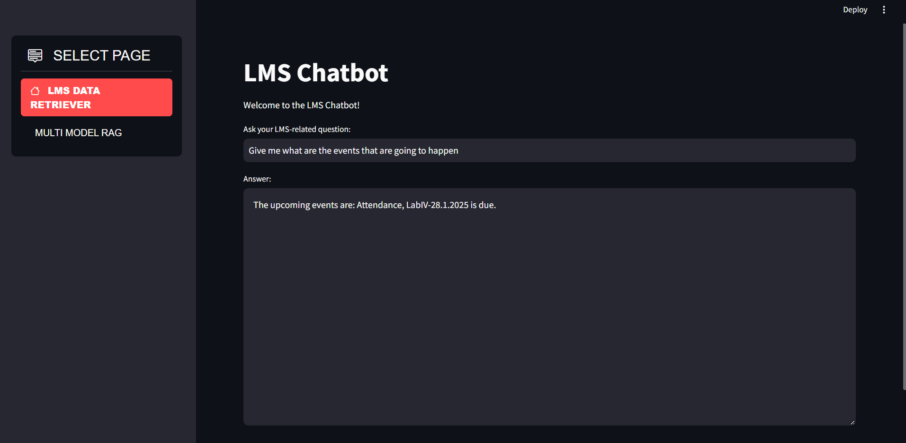
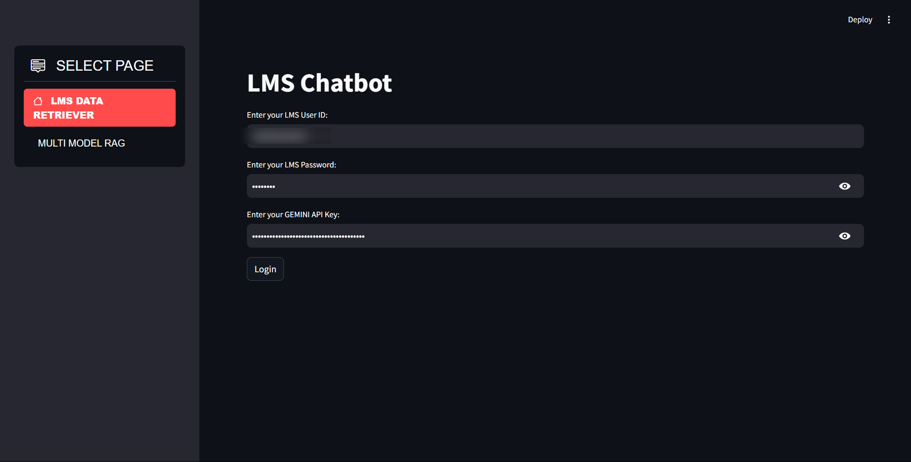
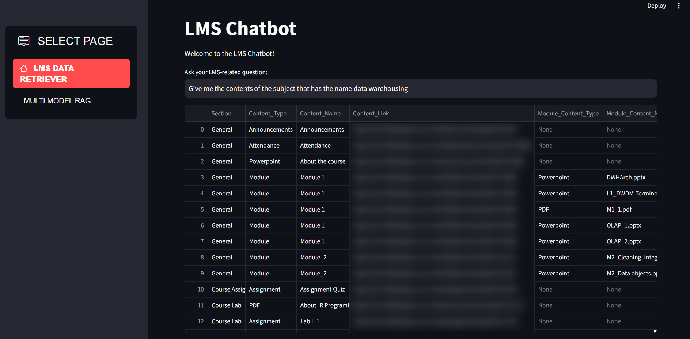
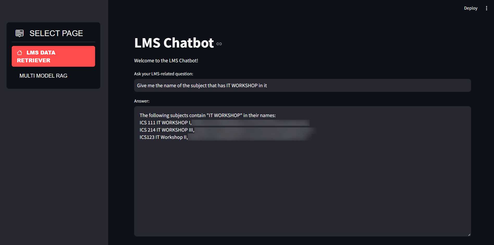
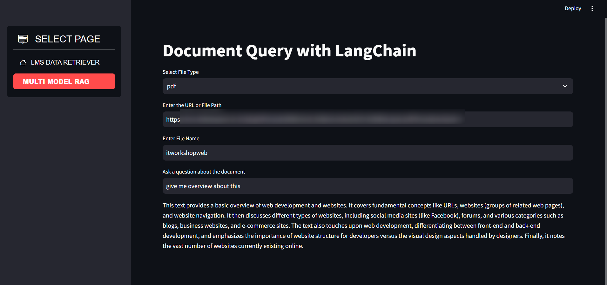

# Project Setup and Usage Guide

This repository helps you interact with your LMS data, perform queries, and interact with PDF/PPT documents using the Multi-Model Retrieval-Augmented Generation (RAG) approach.

## Demo Images

### 1. Expanded Content


### 2. List of All Subjects


### 3. List of Events


### 4. Login Page


### 5. Non-Extended Contents


### 6. Particular Subject Name Search


### 7. RAG Query


## Steps to Get Started

### 1. Clone the Repository
To begin, clone the repository to your local machine:

```bash
git clone <repository_url>
```

### 2. Create a New Python Environment
It's recommended to create a new virtual environment to avoid conflicts with other projects:

```bash
python -m venv venv
```

Activate the environment:
- **On Windows:**

  ```bash
  venv\Scripts\activate
  ```

- **On macOS/Linux:**

  ```bash
  source venv/bin/activate
  ```

### 3. Install Dependencies
Install the necessary dependencies by running the following command:

```bash
pip install -r requirements.txt
```

### 4. Run the Application
Once the dependencies are installed, run the Streamlit application:

```bash
streamlit run final_streamlit.py
```

### 5. Login to the Application
On the first page, enter your LMS **USERNAME** and **PASSWORD** along with the **GEMINI API KEY**.

To get your **GEMINI API KEY**, visit the following website and create an account to obtain a free key:  
[Get Gemini API Key](https://aistudio.google.com/app/apikey)

### 6. Ask Questions
Once logged in, you can ask three types of questions:

#### 6.1 Get Upcoming Events (Submissions)
You can inquire about upcoming events or submissions on your LMS.

#### 6.2 Get the List of Subjects
This will display the entire list of subjects in your LMS, along with their respective links.

#### 6.3 Get the Content of a Specific Subject
Enter the name of a subject (the full name works best) to see its contents in a tabular format. You can even export this table as a **CSV** file.

### 7. Work with PDFs and PPTs (Multi Model RAG)
If you want to interact with PDF or PPT documents, follow these steps:

1. **Copy the PDF URL** you want to analyze.
2. Go to the sidebar and navigate to the page titled **"MULTI MODEL RAG"**.
3. Follow these steps:
    1. **Select the document type** (PDF or PPT) from the dropdown.
    2. **Enter the URL** of the document.
    3. **Enter a name** to save the file (Use only alphabets separated by an underscore `_`).
    4. Now you can chat with the file and get responses to your queries.

### 8. Skip Directly to Multi Model RAG
You can directly go to the **"MULTI MODEL RAG"** page by skipping steps **6** and **7**, but you still need to complete the login step with your **username**, **password**, and **Gemini API key** before proceeding to step **7**.

---

### Troubleshooting
- If you encounter issues with missing dependencies, ensure you’ve run the `pip install -r requirements.txt` step.
- For any API-related issues, ensure that your **Gemini API Key** is valid and active.

For further assistance, feel free to open an issue in the repository or contact the maintainer.

---

Happy Learning! 🚀